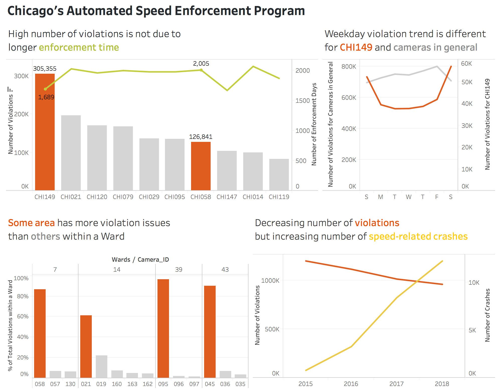

# Findings & Documentation

## Revision of the Dashboard

After my first attempt of a dashboard of the findings of Chicago's Automated Speed Enforcement Program, I revised the dashboard by focusing on conveying the main point of each finding. 
The overall changes include:
* **The size of the dashboard**: from larger to smaller, standard size for better overview of all the findings 
* **Removal of some data exploration charts**: keeping only the important  takeaways
* **Chart types**: combining some separate comparison charts to one chart; presenting data in different ways
* **The use of color**: slight modification
* **Chart title**: change from descriptive titles to arguments
 

**Revised Version**

 
 

## Finding 1: High number of violations is not due to longer enforcement time

From data exploration in the last version, I found that the high number of violations is not necessary caused by longer camera enforcement time. To present the finding, I created a dual axis chart showing both the number of **violations** (bar) and the **enforcement time** (line), focusing on the **top 10 violation cameras**. 

The **Number of Violations** is calculated by summing the **Violations** in [Speed Camera Violations](https://data.cityofchicago.org/Transportation/Speed-Camera-Violations/hhkd-xvj4). 
The **Enforcement Days** is the number calculating the difference of the current date and **Go-Live Date** in [Speed Camera Locations](https://data.cityofchicago.org/Transportation/Speed-Camera-Locations/4i42-qv3h).

From the top 10 cameras in the chart, I highlighted two cameras to emphasize the point. We can see that Camera 149 has the **higher number of violations** than Camera 058, but **lower number of enforcement days**. 

Since **Camera 149** (CHI149) really stood out from others, I also compare the **weekday violation trend** of this particular camera with other cameras in general. We can see the violation weekday trends between CHI149 and other cameras in general are very different. CHI149 has higher number of violations on the **weekends**, while the overall trend has the highest number of violations on **Friday**.  
I created a calculated field to subset the violations for CHI149. The **orange** line in the above chart shows the sum of violations for  CHI149 for each weekday. The **gray** line shows the sum of violations from the original column in the dataset. The scales of them are very different, but since my purpose is to compare the trends, I thought it would make stronger point to show the two lines in the same chart.

 
 

## Finding 2: Some area has more violation issues than others within a Ward

In the first version, I found out that the number of violations of the cameras within a ward varies greatly and selected some wards as examples to show how large the differences are.  
Before, I compared each camera using the **number of violations** of each camera. In this version, I showed the **percentage** of total violations of all cameras within the same Ward for each camera, arguing that almost every ward has a camera with a very large number of violations (composed of more than 60% of the total violations within the ward) comparing to other cameras within the same ward.   
The **Percentage of Total Violations within a Ward** table calculation is the percent of total sum of violations compute using pane.

 
 

## Finding 3: Decreasing number of violations but increasing number of speed-related crashes

In the first version, I showed my finding of the trends for violations and crashes in **separate charts**. Even though the scales of the two numbers are very different, since my purpose is to **compare the trends**, I decided to show the two lines in the **same chart** for making a strong point. We can see that even though the number of violations is decreasing, the number of speed-related crashes is increasing.  

The **Number of Violations** is calculated by summing the **Violations** in [Speed Camera Violations](https://data.cityofchicago.org/Transportation/Speed-Camera-Violations/hhkd-xvj4) for each year. 
The **Number of Crashes** is calculated by counting the rows of the [Crashes Dataset](https://data.cityofchicago.org/Transportation/Traffic-Crashes-Crashes/85ca-t3if) for each year, which I cleaned by keeping only **speed-related crashes** and removing the unnecessary columns.

