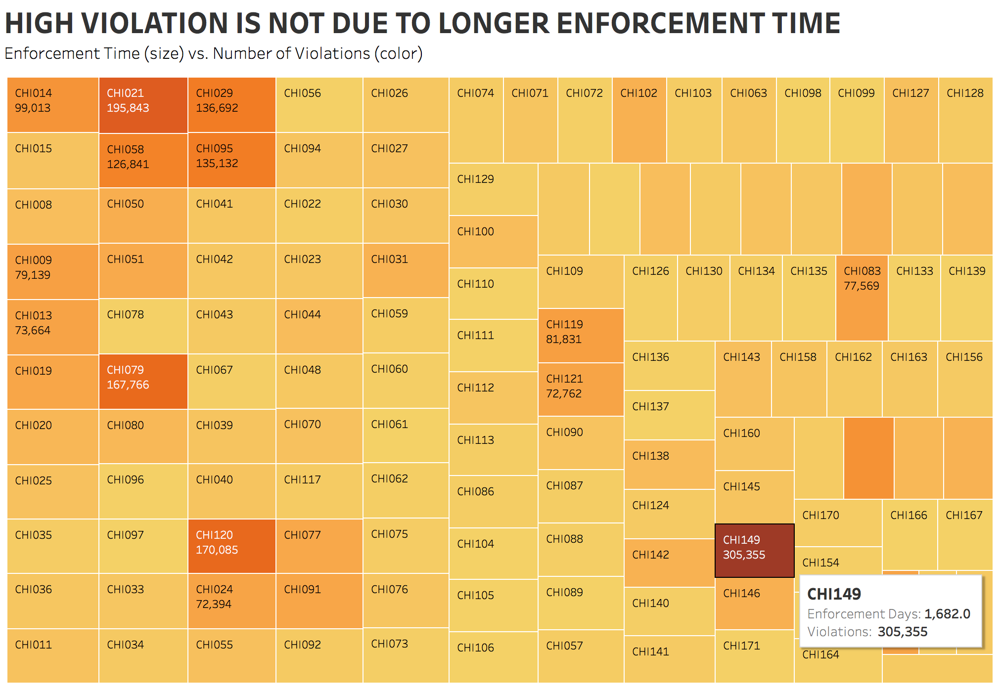
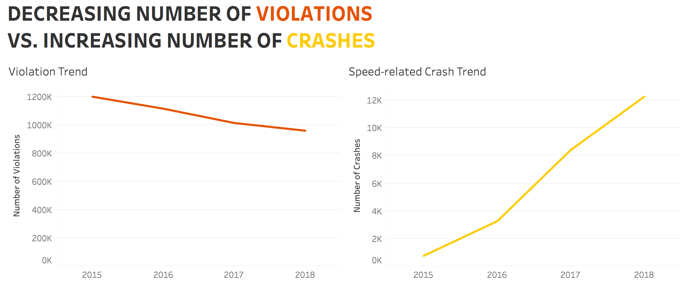

# Chicago's Automated Speed Enforcement Program
A project on interesting findings of Chicago's Automated Speed Enforcement Program data

## Finding 1)   High Violation is NOT due to Longer Enforcement Time
**Datasets & Columns Used**  
[Speed_Camera_Violations](https://data.cityofchicago.org/Transportation/Speed-Camera-Violations/hhkd-xvj4): camera ID, Violation Dates, Violations  
[Speed Camera Locations](https://data.cityofchicago.org/Transportation/Speed-Camera-Locations/4i42-qv3h): GO-LIVE DATE  
I joined the two datasets and calculated the enforcement time of each camera (Today - Go-Live Date).  

Which camera has the highest violations of all time? Is longer enforcement time the cause of high violation?  
I used a treemap to look into the relation between the Number of Days of Camera Enforcement (size) & the Number of Violations (color).  
Cameras with longer enforcement days are in bigger boxes; cameras with more violations are in darker color

We can see that **CHI149** definitely stand out from the chart. Comparing to other cameras, CHI149 hasn't been enforced that long, but has caught a lot more violations.  
I created another chart focusing on the top 10 violation cameras to compare their number of violations and enforcement time.

Based on this finding, I decided to look more into **CHI149** and compare this particular camera with other cameras in general.
We can see the violation weekday trends between CHI149 and other cameras in general are very different.

CHI149 has higher number of violations on the **weekends**, while the overall trend has the highest number of violations on **Friday**.  
I believe there are more interesting findings for CHI149, so I plan on looking into this particular camera in future analysis.

 

## Finding 2)   Number of Violations Varies Greatly within a Ward

At first, I was curious about the number of camera within each ward, so I created a chart to see whether there's a huge difference among the wards. But the chart didn't really show anything interesting. 

So I looked into each camera within a ward, and found out that the number of violations of the cameras within a ward varies greatly. I selected five wards as examples to show how large the differences are.

Why the number of violations of the cameras within the same ward varies so much? Is it because the cameras are implemented at improper locations? Should we do more research on where to implement the cameras? For example, we can consider implementing more cameras near the larger number of violation cameras and reducing the number of cameras near the smaller number of violation cameras. 

**Chart Making Process:**  
At the beginning, I used the same color for all the cameras.  

Then I decided to highlight the ones with very large number to make the point more clear.  

Almost every ward has a camera with a very large number of violations comparing to other cameras within the same ward. This finding is intriguing and I plan on analyzing it more in the future.

 

## Finding 3)   Decreasing Number of Violations vs.   Increasing Number of Speed-Related Crashes

I was curious about whether there's a relation between the number of violations and the number of speed-related traffic crashes.   
During the Data Exploration of Speed Camera Violation dataset, we found that there's an overall decreasing number of violation trend from 2014 to 2019. It would be useful to know whether the reduction of speed violation has actually helped reduce the number of speed-related traffic crash. 
 
At first, I cleaned (keep only speed-related crashes) and merged the [Violations](https://data.cityofchicago.org/Transportation/Speed-Camera-Violations/hhkd-xvj4) and [Crashes](https://data.cityofchicago.org/Transportation/Traffic-Crashes-Crashes/85ca-t3if) dataset on DATE, LATITUDE, LONGITUDE. I wanted to see for a given day, how many crashes happened at the camera location, so I could then compare the number of violations and the number of crashes to see whether there's a relation.  
The table below is how the merged table looks like. As you can see, there are a lot of NA regarding the crash data since it's hard to have crashes that happened at the exact location as the camera. The chart using this dataset is also very likely to be biased.

 
 
 

Therefore, I decided not to merge the two datasets but to create separate charts, showing the overall trend of violations and crashes throughout Chicago. Since the data in 2014 and 2019 are not complete (data starts from July in 2014 and ends in April (now) in 2019), I exclude those two years and focus on the **trend from 2015 to 2018**.  
More data wrangling detail can be found [here](Violations_Crashes_Data_Cleaning.ipynb)
 

The charts showed that even though the number of violations is **decreasing**, the number of speed-related crashes is **increasing**. This finding definitely is worth looking into, as it is important to evaluate the impact on implementing speed violation cameras.

 

**Dashboard of this project can be found here (link)**

 

## Data Source
* Speed Camera Violations [Data](https://data.cityofchicago.org/Transportation/Speed-Camera-Violations/hhkd-xvj4)
* Speed Camera Locations [Data](https://data.cityofchicago.org/Transportation/Speed-Camera-Locations/4i42-qv3h)
* Traffic Crashes - Crashes [Data](https://data.cityofchicago.org/Transportation/Traffic-Crashes-Crashes/85ca-t3if)
